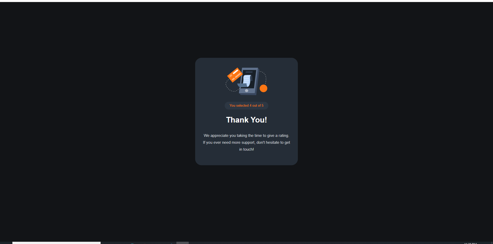

# Frontend Mentor - Interactive rating component solution

This is a solution to the [Interactive rating component challenge on Frontend Mentor](https://www.frontendmentor.io/challenges/interactive-rating-component-koxpeBUmI). Frontend Mentor challenges help you improve your coding skills by building realistic projects.

## Table of contents

- [Overview](#overview)
  - [The challenge](#the-challenge)
  - [Screenshot](#screenshot)
  - [Links](#links)
- [My process](#my-process)
  - [Built with](#built-with)
  - [What I learned](#what-i-learned)
  - [Continued development](#continued-development)
  - [Useful resources](#useful-resources)
- [Author](#author)
- [Acknowledgments](#acknowledgments)

## Overview

### The challenge

Users should be able to:

- View the optimal layout for the app depending on their device's screen size
- See hover states for all interactive elements on the page
- Select and submit a number rating
- See the "Thank you" card state after submitting a rating

### Screenshots





### Links

- Solution URL: [Github](https://github.com/Priyanshi233/Interactive-rating-component/tree/master)
- Live Site URL: [Netlify](https://lucky-beijinho-16ffbd.netlify.app/)

## My process

### Built with

- Semantic HTML5 markup
- CSS custom properties
- Flexbox
- CSS Grid
- Mobile-first workflow
- [Styled Components](https://styled-components.com/) - For styles

### What I learned

I learned a lot in this project about how to use JS file with HTML and document.getElementByID function

```html
<a class="dot2" id="1" tabindex="1">1</a>
```

```css
.star {
  left: 50%;
  top: 50%;
  position: relative;
  transform: translate(-50%, -50%);
}
.dot {
  height: 60px;
  width: 60px;
  border-radius: 50%;
  background-color: hsl(213, 19%, 22%);
  display: inline-block;
  transform: translate(50%, 50%);
  filter: opacity(0.8);
}
```

```js
function assignVal(val) {
  rating = val;
  document.getElementById("result").innerHTML =
    "You selected " + val + " out of 5";
}

function thankScreen() {
  document.getElementById("first-container").style.display = "none";
  document.getElementById("second-container").style.display = "block";
}
```

### Continued development

I will continue to learn more about HTML, CSS & JS and their functions together. And will continue to improve my frontend skills.

### Useful resources

- [For Displaying card component](https://www.w3schools.com/jsref/prop_style_display.asp)
- [For correct positioning of images and card component](https://www.w3schools.com/css/css3_2dtransforms.asp)

## Author

- Website - [Priyanshi Somani](https://github.com/Priyanshi233)
- Frontend Mentor - [@Priyanshii677](https://www.frontendmentor.io/profile/Priyanshii677)

## Acknowledgments

Thank you to Google Search and the websites mentioned in the Useful resource section.
